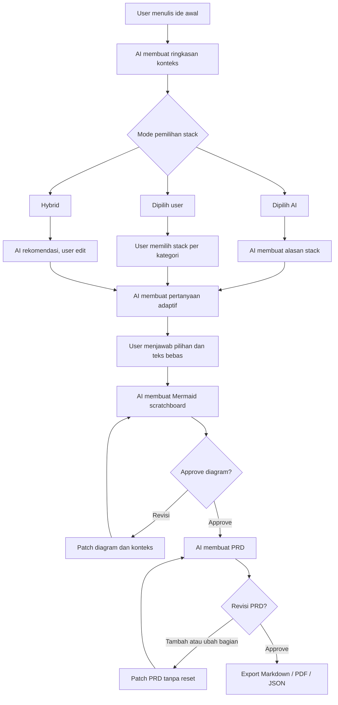
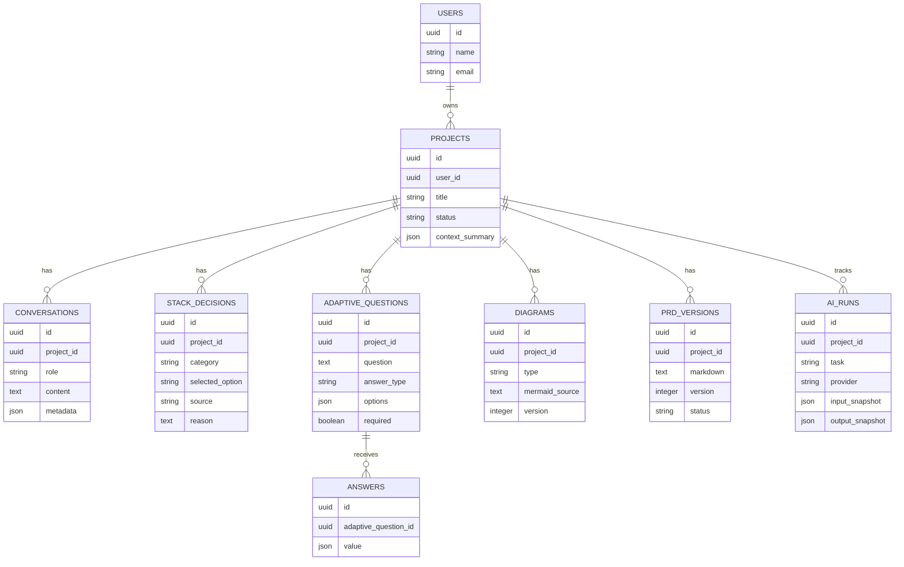
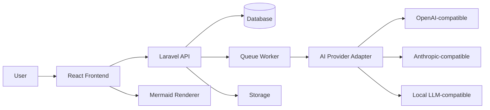

# PRD: AI PRD Builder

## 1. Summary

AI PRD Builder adalah website open source yang membantu pengguna mengubah ide mentah menjadi Product Requirements Document (PRD) yang rapi, lengkap, dan siap dipakai untuk development. Produk ini bekerja seperti kombinasi chatbot AI, wizard pemilihan stack, papan diagram Mermaid, dan editor PRD.

Tujuan utamanya bukan hanya membuat template PRD. Tujuannya adalah membuat alur berpikir produk yang adaptif: AI memahami konteks ide pengguna, menanyakan hal yang relevan, membuat diagram, lalu menyusun PRD berdasarkan proses tersebut.

## 2. Contacts

| Nama | Role | Catatan |
| --- | --- | --- |
| Malik | Product Owner | Pemilik ide, penentu arah produk, dan reviewer hasil PRD |
| AI Assistant | Product Copilot | Membantu klarifikasi ide, memilih stack, membuat diagram, dan menulis PRD |
| Contributor Open Source | Developer / Designer | Membantu implementasi fitur, dokumentasi, dan integrasi provider AI |

## 3. Background

Banyak orang punya ide aplikasi, tetapi sulit mengubah ide itu menjadi dokumen produk yang jelas. Biasanya mereka langsung masuk ke coding, lalu bingung di tengah jalan karena fitur, target pengguna, alur data, dan batasan teknis belum dipikirkan.

Template PRD memang membantu, tetapi sering terlalu kaku. Pertanyaan seperti "target market siapa?" tidak selalu relevan untuk semua proyek. Untuk proyek pribadi, eksperimen kecil, tool internal, atau aplikasi latihan, pertanyaan seperti itu bisa terasa mengganggu.

AI PRD Builder ingin memecahkan masalah itu dengan cara yang lebih natural. Pengguna memulai dari cerita bebas. AI lalu membaca konteks, membuat ringkasan, memilih atau membantu memilih stack, membuat pertanyaan yang sesuai dengan jenis proyek, menyusun diagram, dan akhirnya membuat PRD.

Kenapa sekarang? AI sudah cukup kuat untuk memahami konteks ide, membuat pertanyaan lanjutan, dan menghasilkan struktur dokumen. Di sisi frontend, React, TypeScript, Tailwind, shadcn/ui, Motion, Lenis, dan Mermaid sudah cukup matang untuk membangun pengalaman web yang ringan, modern, dan interaktif. Di sisi backend, Laravel cocok untuk aplikasi open source yang butuh auth, database, queue, API, dan deployment yang jelas.

## 4. Objective

### Objective Utama

Membuat website open source yang membantu pengguna membuat PRD berkualitas dari ide awal tanpa harus paham format PRD, diagram teknis, atau pemilihan stack dari awal.

### Kenapa Ini Penting

Produk ini membantu pengguna:

- Menyusun ide yang masih berantakan.
- Mendapat pertanyaan yang relevan, bukan template kaku.
- Memilih stack secara manual atau dibantu AI.
- Melihat struktur produk melalui diagram Mermaid.
- Merevisi bagian tertentu tanpa mengulang proses dari awal.
- Mengekspor PRD untuk dipakai developer, AI coding agent, atau tim.

### Key Results

| Key Result | Target Awal |
| --- | --- |
| Waktu dari ide mentah ke PRD pertama | Di bawah 15 menit untuk proyek sederhana |
| Relevansi pertanyaan AI | Minimal 80% pertanyaan dianggap berguna oleh pengguna |
| Revisi PRD | Pengguna bisa memperbaiki bagian tertentu tanpa membuat project baru |
| Ekspor dokumen | PRD bisa diekspor ke Markdown pada MVP |
| Diagram | Minimal 3 jenis diagram dapat dibuat dari satu project: alur fitur, arsitektur, dan relasi data |

## 5. Market Segments

Produk ini tidak dibatasi oleh umur atau jabatan. Segmen utamanya ditentukan oleh masalah yang mereka punya.

### Segment 1: Solo Builder

Pengguna yang punya ide aplikasi dan ingin menyiapkan rancangan sebelum coding. Mereka butuh bantuan agar idenya lebih jelas, tetapi tidak ingin alur yang terlalu formal.

### Segment 2: Developer yang Memakai AI Coding Agent

Developer yang ingin memberi instruksi yang jelas ke AI coding agent. Mereka butuh PRD, diagram, stack, dan batasan fitur agar hasil coding lebih akurat.

### Segment 3: Founder atau Product Person

Pengguna yang ingin mengubah ide bisnis menjadi rancangan produk. Mereka butuh PRD yang bisa dibaca oleh designer, developer, atau stakeholder.

### Segment 4: Tim Internal

Tim kecil yang ingin membuat tool internal. Mereka biasanya tidak butuh PRD panjang, tetapi tetap butuh alur fitur, role user, data, dan prioritas.

### Segment 5: Pelajar atau Mahasiswa RPL

Pengguna yang butuh bantuan membuat dokumen analisis, diagram, use case, ERD, activity diagram, sequence diagram, dan PRD untuk tugas atau proyek belajar.

## 6. Value Propositions

### Nilai Utama

AI PRD Builder membuat proses pembuatan PRD terasa seperti ngobrol dengan product partner, bukan mengisi formulir panjang.

### Yang Didapat Pengguna

- Ide mentah berubah menjadi struktur produk.
- AI menanyakan hal yang relevan dengan jenis proyek.
- Pengguna bisa memilih stack sendiri atau membiarkan AI memilih.
- Mermaid diagram dibuat otomatis, tetapi tetap bisa diedit.
- Revisi kecil tidak merusak proses yang sudah ada.
- PRD akhir punya dasar dari chat, pilihan stack, jawaban, dan diagram.

### Masalah yang Dihindari

- PRD terlalu template dan tidak cocok dengan proyek.
- Harus mengulang dari awal saat ada tambahan kecil.
- Stack dipilih asal-asalan.
- Diagram dibuat terpisah dari konteks produk.
- AI menulis PRD tanpa memahami proses berpikir sebelumnya.

### Pembeda

| Produk Biasa | AI PRD Builder |
| --- | --- |
| Form PRD statis | Pertanyaan adaptif dari AI |
| Chatbot hanya menulis dokumen | Chatbot plus stack selector plus diagram plus editor |
| Diagram dibuat manual | Diagram Mermaid dibuat dari konteks ide |
| Revisi sering mulai ulang | Revisi bersifat patch pada konteks yang sudah ada |
| Stack tidak terhubung ke PRD | Stack menjadi bagian dari keputusan produk |

## 7. Solution

### 7.1 UX dan User Flow

#### Flow Utama

1. Pengguna membuka website.
2. Pengguna menjelaskan ide aplikasi dalam chat.
3. AI membuat ringkasan ide awal.
4. Pengguna masuk ke tahap pemilihan stack.
5. Pengguna memilih salah satu:
   - AI memilihkan stack.
   - Pengguna memilih stack sendiri.
   - Hybrid: AI memberi rekomendasi, pengguna bisa mengubah.
6. AI membuat pertanyaan lanjutan yang adaptif.
7. Pengguna menjawab dengan pilihan, teks bebas, atau opsi lain.
8. AI membuat Mermaid scratchboard.
9. Pengguna bisa approve, edit sendiri, atau minta AI revisi.
10. AI membuat PRD akhir.
11. Pengguna bisa revisi bagian tertentu.
12. Pengguna mengekspor PRD.

#### Diagram Flow Produk



### 7.2 Key Features

#### 1. AI Idea Intake Chat

Chat pertama harus terasa seperti chatbot AI biasa. Pengguna boleh menjelaskan idenya dengan bahasa bebas.

AI harus menghasilkan:

- Ringkasan ide.
- Tujuan produk sementara.
- Jenis proyek.
- Tingkat kompleksitas.
- Hal yang masih belum jelas.
- Dugaan stack yang cocok.

#### 2. Stack Selection

Ada dua mode utama dan satu mode tambahan.

| Mode | Fungsi |
| --- | --- |
| AI memilih | AI memilih stack berdasarkan kebutuhan produk |
| User memilih | Pengguna memilih sendiri dari daftar stack |
| Hybrid | AI memberi default, pengguna bisa ganti |

Kategori stack awal:

- Frontend framework.
- UI library.
- Styling.
- Animation.
- Smooth scroll.
- Backend framework.
- Database.
- Auth.
- AI provider.
- API style.
- Diagram engine.
- Export document.
- Deployment.
- Testing.

Contoh pilihan:

| Kategori | Pilihan Awal |
| --- | --- |
| Frontend | React 18, TypeScript, Vite |
| Styling | Tailwind CSS v4 |
| UI | shadcn/ui |
| Animation | Motion / Framer Motion |
| Smooth scroll | Lenis |
| Diagram | Mermaid |
| Backend | Laravel API |
| Local environment | Laragon |
| Database | MySQL, PostgreSQL, SQLite untuk local MVP |
| Queue | Redis atau database queue |
| Auth | Laravel Sanctum |
| AI Provider | OpenAI-compatible provider, Anthropic-compatible provider, local provider |
| Deployment | Docker Compose, VPS, shared hosting untuk Laravel, static frontend plus API |

Catatan penting: Laragon bukan backend framework. Laragon adalah local development environment. Backend tetap perlu framework seperti Laravel. Karena Anda menyebut Laragon, rekomendasi paling cocok adalah Laravel API dengan MySQL atau PostgreSQL.

#### 3. Adaptive Question Generator

Pertanyaan tidak boleh template tetap. AI harus membuat pertanyaan dari ringkasan ide, tipe proyek, stack, dan jawaban sebelumnya.

Contoh:

- Jika proyek adalah tool pribadi, AI tidak wajib bertanya target market.
- Jika proyek adalah SaaS, AI perlu bertanya user role, pricing, onboarding, dan retention.
- Jika proyek adalah marketplace, AI perlu bertanya relasi buyer, seller, listing, payment, dispute, dan moderation.
- Jika proyek adalah tugas RPL, AI perlu bertanya aktor, use case, data entity, dan diagram yang dibutuhkan.

Format pertanyaan:

- Pilihan tunggal.
- Multi select.
- Text box.
- Opsi "Lainnya".
- Tombol "Lewati".
- Tombol "AI isi dulu".

Setiap pertanyaan harus punya alasan singkat secara internal, tetapi alasan itu tidak harus selalu ditampilkan ke user.

#### 4. Question Answer UI

UI pertanyaan berbentuk list atau step cards. Tiap pertanyaan bisa punya pilihan cepat di bawahnya.

Contoh:

```text
Bagian mana yang paling penting untuk versi pertama?

[Chat ide] [Stack selector] [Diagram Mermaid] [Export PRD] [Lainnya]

Lainnya:
[____________________________]
```

#### 5. Mermaid Scratchboard

Scratchboard adalah area diagram seperti papan kerja. Bentuknya bukan Miro penuh, tetapi punya rasa yang mirip: pengguna bisa melihat struktur, menambah node, mengedit isi Mermaid, dan meminta AI memperbaiki diagram.

Jenis diagram MVP:

- Flowchart fitur.
- ERD atau relasi data.
- Sequence diagram untuk proses AI generate PRD.
- Use case diagram sederhana.
- Architecture diagram.

Contoh ERD awal:



#### 6. Revision Without Restart

Produk harus punya sistem snapshot dan patch. Setiap perubahan disimpan sebagai versi.

Contoh:

- User: "Tambahkan fitur export PDF."
- AI tidak mengulang dari awal.
- AI menambah fitur export PDF ke konteks, diagram, dan PRD.
- Versi baru dibuat.
- Versi lama tetap bisa dilihat.

Jenis revisi:

| Jenis Revisi | Perilaku Sistem |
| --- | --- |
| Tambah fitur | Update konteks, diagram, dan PRD |
| Ubah stack | Tandai dampak ke backend/frontend/deployment |
| Hapus fitur | Update scope dan diagram |
| Ubah dari awal | Buat branch atau project baru |
| Edit manual | Simpan sebagai perubahan user |

#### 7. PRD Generator

PRD akhir dibuat setelah diagram dan konteks disetujui.

Isi PRD minimal:

- Ringkasan produk.
- Masalah yang diselesaikan.
- Pengguna utama.
- Tujuan produk.
- Scope MVP.
- Fitur utama.
- User flow.
- Data model.
- API awal.
- Stack teknis.
- Diagram Mermaid.
- Risiko dan asumsi.
- Roadmap.
- Acceptance criteria.

#### 8. Export

MVP harus mendukung:

- Markdown.
- JSON project context.

Fase berikutnya:

- PDF.
- DOCX.
- Copy prompt untuk AI coding agent.
- Export folder berisi PRD, Mermaid, API spec, dan task breakdown.

### 7.3 Technology

#### Frontend

| Area | Rekomendasi |
| --- | --- |
| Language | TypeScript |
| Framework | React 18 |
| Build tool | Vite |
| Styling | Tailwind CSS v4 |
| UI | shadcn/ui |
| Animation | Motion / Framer Motion |
| Smooth scroll | Lenis |
| Diagram preview | Mermaid |
| State | Zustand atau TanStack Query plus local state |
| Forms | React Hook Form plus Zod |
| Editor | Monaco Editor atau CodeMirror untuk Mermaid dan PRD markdown |

#### Backend

| Area | Rekomendasi |
| --- | --- |
| Framework | Laravel API |
| Local dev | Laragon |
| Database | MySQL untuk Laragon, PostgreSQL untuk deployment serius, SQLite untuk demo lokal |
| Auth | Laravel Sanctum |
| Queue | Laravel Queue dengan Redis atau database driver |
| AI jobs | Async job untuk generate question, diagram, dan PRD |
| Storage | Local storage untuk MVP, S3-compatible untuk deployment |
| Export | Markdown lebih dulu, PDF/DOCX setelah MVP |

#### AI Architecture

AI tidak boleh hanya menerima prompt panjang sekali lalu menulis PRD. AI perlu beberapa task kecil.

| Task AI | Output |
| --- | --- |
| summarize_idea | Ringkasan, jenis proyek, masalah, fitur awal |
| recommend_stack | Stack pilihan dan alasan |
| generate_questions | Pertanyaan adaptif dengan opsi |
| update_context | Patch konteks dari jawaban user |
| generate_diagrams | Mermaid source |
| revise_diagram | Mermaid patch |
| generate_prd | PRD Markdown |
| revise_prd | Patch PRD berdasarkan instruksi user |

Output AI sebaiknya diminta dalam JSON schema agar frontend dan backend mudah memprosesnya.

#### High Level Architecture



### 7.4 Assumptions

- Pengguna ingin proses yang terasa fleksibel, bukan form panjang.
- Diagram Mermaid cukup untuk MVP karena mudah diekspor dan open source friendly.
- React 18, TypeScript, Tailwind v4, shadcn/ui, Motion, dan Lenis cocok untuk frontend yang smooth dan ringan.
- Laravel cocok untuk backend karena ekosistemnya kuat untuk auth, queue, database, dan API.
- Laragon cocok sebagai local environment, terutama untuk pengguna Windows.
- Pengguna open source mungkin ingin memakai API key AI sendiri.
- Tidak semua pengguna ingin login pada versi awal. Untuk MVP lokal, project tanpa login bisa dipertimbangkan.

## 8. Release

### MVP

Fokus MVP adalah membuat satu alur end-to-end yang benar-benar jalan.

Scope:

- Chat ide awal.
- Ringkasan AI.
- Stack selector manual dan AI.
- Pertanyaan adaptif.
- Jawaban dengan pilihan dan text box.
- Generate Mermaid flowchart dan ERD.
- Edit Mermaid source.
- Approve diagram.
- Generate PRD Markdown.
- Revisi PRD dengan instruksi tambahan.
- Export Markdown.
- Simpan project lokal di database.

Tidak masuk MVP:

- Collaboration real-time.
- Marketplace template.
- Multi-tenant billing.
- Export DOCX.
- Integrasi Figma.
- Drag and drop diagram penuh seperti Miro.

### Phase 2

- Auth dan project dashboard.
- Version history.
- Branching project.
- Export PDF.
- Prompt untuk AI coding agent.
- Diagram tambahan: sequence, use case, activity, deployment.
- Provider AI bisa dipilih dari UI.
- Enkripsi API key jika disimpan.

### Phase 3

- Collaboration.
- Commenting.
- Plugin stack registry.
- Template komunitas.
- Public share link.
- GitHub export.
- Generate backlog, user stories, dan API spec.

## Open Source Notes

Produk harus ramah untuk self-host.

Rekomendasi:

- Gunakan lisensi MIT atau Apache-2.0.
- Sediakan `.env.example`.
- Jangan hardcode API key.
- Support BYOK: pengguna pakai API key sendiri.
- Sediakan Docker Compose setelah MVP stabil.
- Pisahkan AI provider adapter agar komunitas bisa menambah provider baru.
- Simpan prompt system dan prompt task sebagai file versioned agar mudah dikontribusi.

## Risiko

| Risiko | Mitigasi |
| --- | --- |
| AI membuat pertanyaan yang tetap terasa template | Simpan konteks proyek dan paksa AI memberi alasan relevance per pertanyaan |
| Mermaid error | Tambahkan validasi Mermaid dan tombol auto-fix |
| PRD terlalu panjang | Sediakan pilihan ringkas, normal, detail |
| Revisi merusak konteks | Gunakan snapshot dan version history |
| Biaya AI tinggi | Pecah task, cache hasil, dan support provider lokal |
| User bingung dengan stack | Pakai mode hybrid sebagai default |

## Acceptance Criteria MVP

- Pengguna bisa membuat project baru dari chat ide awal.
- AI membuat ringkasan ide dalam format terstruktur.
- Pengguna bisa memilih stack manual atau menerima rekomendasi AI.
- AI membuat pertanyaan adaptif yang berbeda tergantung jenis proyek.
- Pengguna bisa menjawab pertanyaan dengan pilihan dan teks bebas.
- Sistem bisa membuat minimal dua diagram Mermaid dari konteks project.
- Pengguna bisa mengedit Mermaid source.
- AI bisa memperbaiki diagram tanpa membuat project baru.
- Sistem bisa membuat PRD Markdown dari konteks akhir.
- Revisi kecil pada PRD tidak menghapus konteks sebelumnya.
- Project dan versi PRD tersimpan di database.

## Rekomendasi Keputusan Awal

Saya sarankan mode default bukan "AI memilih semua" atau "User memilih semua", tetapi "Hybrid".

Alasannya:

- Pengguna pemula tidak bingung.
- Pengguna teknis tetap bisa mengubah stack.
- AI bisa menjelaskan alasan stack.
- PRD akhir tetap mencatat keputusan teknis dengan jelas.

Untuk backend, pilihan paling cocok adalah Laravel API. Laragon tetap dipakai sebagai local environment. Dengan begitu, stack Anda menjadi jelas:

```text
Frontend: React 18 + TypeScript + Vite + Tailwind v4 + shadcn/ui + Motion + Lenis
Backend: Laravel API
Local Dev: Laragon
Database: MySQL untuk lokal, PostgreSQL opsional untuk production
AI: Provider adapter dengan API key dari user
Diagram: Mermaid
Export: Markdown dulu, PDF/DOCX setelah MVP
```

